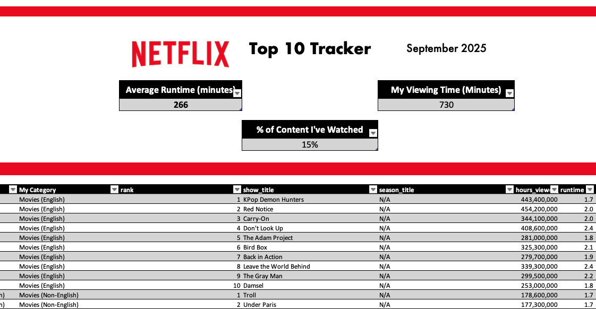

---

For this tutorial, we'll use data on the most popular content on Netflix. 

You'll be creating a tracker to see how many of the top Netflix titles you've seen or want to see! The finished product will look something like this:

  

---

To download the data:
1. Go to [netflix.com/tudum/top10/​](https://www.netflix.com/tudum/top10) and click the download icon on the right 
2. Click `Lists` at the top
3. Next to “Most Popular Lists” click Excel
4. Save your file
5. Open up the file in Excel or Google Sheets

---

> ❓ **Should I use Excel or Google Sheets?**
>
> You can complete this tutorial using Microsoft Excel or Google Sheets (or even Apple Numbers)! 
>
> Most commonly-used features in Excel also exist in Google Sheets​ (note that the menus or names may be slightly different).​ 
>
> Same is true for Mac vs. PC​, there are some variations in menus and keyboard shortcuts​.
---

## Cells, Rows, and Columns

First things first: rows vs. columns!
* Rows go horizontally (left to right) and are labeled with numbers (e.g. "Row 5")
* Columns go vertically (up and down) and are labeled with letters (e.g. "Column G")
* Cells are labeled by their row and column, e.g. "Cell G5"
* A range is a group of cells, separated by a colon (e.g. "G5:H10")
* You can select a whole row or column, or multiple rows/columns, by clicking on their number or letter label

## Cell Formatting
First, we're going to format our data as a table, and add some visual improvements.
1. Select all data (select any filled-in cell, hit Cmd-A), then click Format as Table from the ribbon and choose a style 
2. Select the first 10 rows of your sheet, then right-click and click Insert. This should add 10 more empty rows up above your table.
3. Next we'll add the Netflix logo. 
    * Click one of your new empty cells near the center. In the ribbon, choose Insert -> Pictures -> Place in Cell -> Online Pictures. 
    * Search for Netflix in the sidebar that appears, choose an image, and click Insert. (If this doesn't work, download an image first and select that one from photo browser instead.) 
    * Once the image appears, make it larger by expanding the row height and column width. 
4. To add a title, click the cell to the right of your logo, and type in `Top 10 Tracker`. Use the formatting bar to add:
    * Center Text
    * Middle Align
    * Increase Font Size (and change font, if desired)

## Data Validation

Create new another column that you can use to track whether you've seen this content:
1. Create a new "tab" (sheet) in your workbook, and type these values into the first 4 cells:
    * “No”
    * “No but on my list”
    * “Yes and loved it”
    * ”Yes and didn’t love it”​
2. Go back to the main sheet. Right-click the rightmost column of the table and choose Insert -> Table Columns to Right
3. Give your new column a name in the header, like `Seen?`
4. Select the first blank cell under your header, then select the blanks all the way down to the end of the list of titles. (Pro tip: after clicking on that first cell, hit Shift+Cmd+down arrow key to automatically select the correct range.)
5. From the ribbon, go to Data, then Data Validation
6. Choose List. Under Source, click the browse icon on the right, navigate to your second sheet, and select all 4 of your values (Shift-click to select all). Once they are selected, click the Browse icon on the pop-up again to complete the settings
7. Under "Error Alerts", type in an error message that the user will see if they try to type in a value that's not on the list of options.
8. Click OK
9. Fill out the field on a few rows to make sure it works!

## Row-Based Formulas
Formulas let you apply logic or math to cells. There are three important components to each formula:
* It must start with an `=`, this is the signal to Excel that a formula is in this cell
* Next is the name of the function
* Next are parentheses `()` which may be empty or may contain one or more inputs to the function, called arguments. If there are multiple arguments, they are separated with commas 

**Pro Tip!** Whenever you start typing in a function name, Excel will provide a helpful pop-up to show you how many inputs you'll need and what they are. For a more detailed description, go to the View menu (not the ribbon) and click Formula Builder, which will give you a sidebar with more info on what each argument is.

### Math formulas
Next, we'll test out a simple math formula by adding a column for the length of each content piece in minutes:
1. Add a new column to your table (right-click the rightmost column of the table and choose Insert -> Table Columns to Right)
2. Give it a title like `Runtime in Minutes`
3. In the first cell, type in `=`
4. Next, select the first cell in the column for Runtime (which is in hours). Your formula should look something like `=F13`
    * You may notice that as soon as you type this in, Excel will automatically replace it with something like `[@runtime]`. This is just Excel being super-smart and recognizing that since you've selected a cell in that column of your table, it's replacing it with a dynamic reference. This is totally fine and works the same way!
5. Next add the multiplication symbol `*` (all the general math symbols can be used in formulas, things like `+`, `-`, `/`, `^`, etc.) followed by the number of minutes in an hour, 60
6. Make sure your formula looks something like `=F13*60` and hit Enter

### Date formulas
Next, we'll add a tracker for the number of days it's been since you've seen each piece of content.
1. Add a new column to your table called "Date Seen" and fill in a date for at least one piece of content.
2. Add a new column to your table called "Days Since Seen" and add the following formula to the first table row:
    `=today() - G7`
3. This column will tell you how many calendar days it's been since you saw that piece of content. 

### Text formulas
We'll add a formula that will replace the category name Films with the name Movies.
1. Add a new column to the right of your table called My Category
2. Use the formula `=SUBSTITUTE` which takes 3 arguments in this order: 
    * The cell containing the text you want to substitute
    * The piece of text, in double-quotes, that you want to replace (e.g. `"Films"`)
    * The new piece of text, in double-quotes, that should go there instead
3. Hit Enter. The formula should auto-apply down the rest of the column, but if it doesn't, you can copy-paste it down

### Logic formulas 
We'll add a simple logic formula that will tell us whether the content was ranked in the top 3 for its category.
1. Add a column called Is Top 3?
2. Use the formula `=IF` which takes 3 arguments in this order:
    * A comparison that can be true or false (in this case, we are checking if the cell in the rank column is `<4`)
    * What the result should be if the first comparison is true (can be `true` or `"Yes!"` or similar)
    * What the result should be otherwise (i.e. if the comparison is false). Can be `false` or `"Nope!"` or similar
3. Hit Enter. The formula should auto-apply down the rest of the column, but if it doesn't, you can copy-paste it down

## Column-Based (Summary) Formulas
So far, all of our formulas have only referenced cells in their same row. We've essentially been adding on more data about individual content pieces. When formulas are used on columns instead of rows, they are typically summarizing information in some way -- think tallying up a total or taking an average.

Let's look at an example of a summarizing formula to calculate the average runtime of this content.
1. Below your logo header but above your table, add a label like "Average Runtime"
2. In the cell beneath that, use the formula `=AVERAGE` which takes 1 argument: all the cells that you want to take the mathematical average of
3. Hit Enter. You should see a single number
4. Format the label cell and result cell as desired. One option is to select both and choose "Format as Table" from the ribbon, then select your preferred color style

### Summary formulas with logic
Next we'll add a summary formulas that use conditional logic to determine which data to summarize. 

Add a cell between the logo and the table that will sum up the runtime of only the content that you've watched.
1. Type a label in one cell, something like `My Viewing Time`
2. In the cell below, use the formula `=SUMIF` which takes 3 arguments in this order:
    * The column with the value we want to check whether something is true before we count that row into our total sum (in this case, the `Have I Seen It?` column)
    * The actual value that we want to match that column against (in this case, should be `"Yes"` or something similar, needs to exactly match however you spelled/capitalized this in the data validation step)
    * The column with the values we should sum up for the rows where the condition is true (in this case, the `runtime` column)
3. Select both cells and choose Format as Table, then choose your preferred style

**Bonus**: For extra practice, add another summary that will count the number of pieces of content you've seen, using the function `COUNTIF`

## Combining formulas 

Formulas get really powerful when you combine them! You can replace any argument in a formula with, you guessed it, another formula. 

As we keep trying out new functions, you'll need to start looking for yourself to see which inputs each function needs. This is an important skill! You don't have to memorize each function, you just need to be able to figure out how to get a reminder each time you use it. 

**Reminder!** Whenever you start typing in a function name, Excel will provide a helpful pop-up to show you how many inputs you'll need and what they are. For a more detailed description, go to the View menu (not the ribbon) and click Formula Builder, which will give you a sidebar with more info on what each argument is.

### Combining row-based formulas

We'll try this out by creating a (fake) URL for each show, using formulas, written all in a single column, formatted as​: www.netflix.com​ Slash, the name of the show in all lower case, with no spaces​.

**Example:** For the title *Love Is Blind*, we'd want the result to be `www.netflix.com/loveisblind` ​

We'll use 3 formulas for this:
* `LOWER` which makes text all lowercase
* `SUBSTITUTE` which we used earlier to swap Films for Movies; here, we'll use it to swap spaces for an "empty string" (a set of quotes with nothing in between)
* `CONCATENATE​` which "adds" two pieces of text together (to add on the first part of the URL)
​
Hint: start with each formula in a separate column first! ​This way, you can make sure each one creates the desired result, before you combine them all in one cell.

### Combining summary formulas

Next we'll combine some summary formulas to figure out what percentage of these top titles you've seen. The formulas we'll use are:
* `COUNTIF` to count the number of titles you've seen (this works similarly to `SUMIF` from above)
* `COUNTA` to count the total number of titles
* `/` for regular ol' division, to divide our first result by our second result to find our percentage

Be sure to format the cell as %! 

## Formatting finishing touches

This part is totally up to you! Here are some suggestions to make the final product more visually appealing:
1. **Add some color**: Select one of the rows above or below your logo and summary metrics. In the ribbon, hit Fill > More Colors > Eyedropper and hover over the logo red color, then hit OK
2. **Hide the gridlines**: Toggle to the View ribbon, then uncheck the box next to Gridlines
3. **Set it to scroll nicely**: Select the first cell under the category header, then in the View ribbon, hit Freeze Panes. Now your column headers and all the rows above that will stay locked in place when you scroll down in the document

## Level up!
Once you've tried out all these techniques once, grab another dataset and try all these steps again with some variations! Anything you can download into a CSV or Excel format will work. 

Here are some ideas for where to find interesting datasets to work with (for each of these, you can google something like "download my spotify history" for instructions):
* Download your music listening history from a service like Spotify or [Last.fm](https://www.last.fm/about/trackmymusic) 
* Download your TV streaming history from Netflix or other streaming services
* Download your transaction history from your credit card or banking website
* Download your activity data from any step-counting or health-tracking apps or devices you have 
