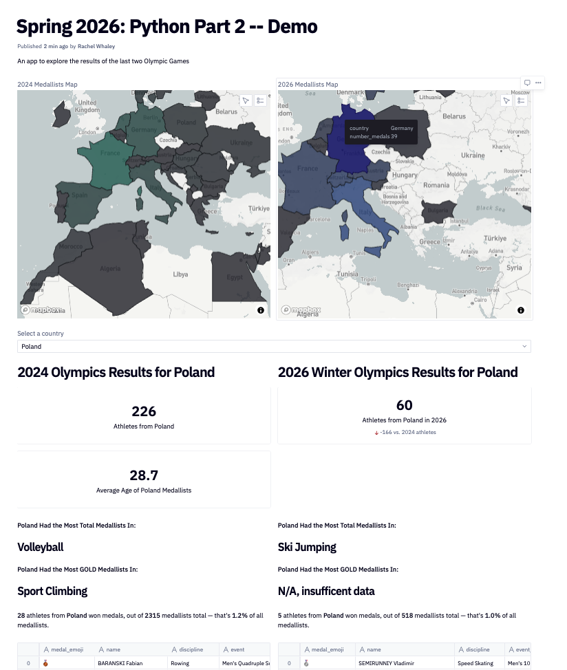

---

In this tutorial, you'll continue to learn how to leverage Python to perform data analysis and create data visualizations. 

You'll be creating a web app to explore the results of the 2024 Paris Olympics! We'll build on the portion we built during [Part 1](../docs/python-part1.md) of this workshop. Our final app will look something like this:

<div style="text-align: center; width: 70%; justify-content: center; margin-left: auto; margin-right: auto; height: auto;">
  
</div>

---
## Get set up in Hex

Whether you're just joining us this week or continuing from part 1, follow the relevant steps below:

**If you participated in Part 1 of this workshop:**
* Log back in to [app.hex.tech](https://app.hex.tech) with your USC credentials
* Open up your project from last week to continue building on, and hit `Run all`
    * If your project from last week has any errors or missing parts, you can also grab the complete version to work from today:
        * Click Projects on the left
        * Find **Spring 2026 Python Part 2**. Hit the `...` icon on the right side, then hit `Duplicate`
        * Add your name to the project title, like `Rachel's Spring 2026 Python Part 2`. This is your personal copy of the workbook to use in today's workshop. 
        * Hit `Run all` in the top right to load our dataset into your workspace

**If you are just joining us for Part 2 today:**
* Follow the invite link found at [digital-lounge-python.carrd.co](https://digital-lounge-python.carrd.co), if you haven't already, to set up your Hex account. Be sure to sign up with your USC email or USC Google/Microsoft credentials.
* Click Projects on the left
* Find **Spring 2026 Python Part 2**. Hit the `...` icon on the right side, then hit `Duplicate`
* Add your name to the project title, like `Rachel's Spring 2026 Python Part 2`. This is your personal copy of the workbook to use in today's workshop. 
* Hit `Run all` in the top right to load our dataset into your workspace 

---

## Review from Part 1

In Part 1 of this workshop, we created several components for our interactive data app:
1. A dropdown selector for Country, which dynamically filters the rest of the components
2. A **dynamic text** heading that inserts the name of the selected country
3. A **single value** component displaying the number of athletes from the selected country
4. Another **single value** component that uses our calculation of athlete age (based on birthday) to display the average age of competitors from the selected country
5. A detailed **display table** with information about all the medallists from the selected country, including a mini visual of the medal they won (gold, silver, or bronze) in emoji form
6. A **dynamic text** summary of the percentage of medals won by athletes from the selected country

---

## Add more complex text data components

Next we'll add a text component to display a slightly more complex summary: the name of the sport where the selected country has the most medallists:
1. Create a dataframe filtering `medallists_data` by the selected country: `medallists_data[medallists_data['country'] == selected_country]`
2. Group the country's medals by discipline to see how many they won for each sport. Run: `country_medallists.groupby('discipline').size()` 
3. Now we want to see the maximum of this list, so try running: `country_medallists.groupby('discipline').size().max()`. However, this shows us the *number* of medallists in the top-winning sport for this country, not the *name* of that sport, which is what we want! Replace `.max()` with `.idxmax()` and re-run to check your result
4. Save that result to a variable called `top_discipline` 
5. Paste the following into a new Markdown cell, and add it to your app view: 
    ```
    **{{selected_country}} Had the Most Total Medallists In:** 

    ### {{ top_discipline }}
    ```
6. Toggle to the App Builder view at the top of your screen and test out whether it changes when you toggle the dropdown! 

---

## Add a component with error-handling

Next we'll add a very similar component to display the name of the sport where the selected country has the most **gold** medallists. 
1. Create another Python cell, after your top_discipline python cell but before the Markdown cell. 
2. Create a variable called `top_golds_discipline` and assign to it the sport where this country has the most GOLD medallists.
    <details>
    <summary><i>Toggle for a hint!</i></summary>
        The value shoud be very similar to how we defined top_discipline above, but with an added filter for ['medal_code'] == 1. Use the filter we put on medallists_data in the previous component as a template! 
    </details>
3. Add the following to your Markdown cell below the existing section:
    ```
    ---
    **{{selected_country}} Had the Most GOLD Medallists In:** 

    ### {{ top_golds_discipline }}
    ```
4. Add this cell to the app, toggle to the App Builder view at the top of your screen and test out whether it changes when you toggle the dropdown! What does this component display if you select a country where there were no gold medallists, such as Malaysia? (No shade to Malaysia!) 
5. Head back to your notebook view because we are going to add some **error handling**, or defining what our app should display if a component is missing data. We'll use a **try-except** block to **try** our existing formula, and if it comes up eith an error, set a value to display in that "exception" case. Update your python cell defining your variable to this structure (indentation is important in python): 
    ```
    try: 
        top_golds_discipline = [YOUR DEFINITION HERE]
    except:
        top_golds_discipline = "N/A, insufficent data"
    ```
6. Toggle to the App Builder view at the top of your screen and try filtering by Malaysia again, to see what happens! 

---

## Add more datasets to your app

Since the 2026 Olympics just wrapped up, next we're going to add in data on medallists from that competition to add a comparison element to our app. To add this new dataset:
1. Go to this [link](https://uscedu-my.sharepoint.com/:f:/g/personal/whaleyr_usc_edu/IgC5BlZ36qU6SbY5r9HOOSq9AScSPmnFJk1LUWCKynEU72k?e=px9zBC) (make sure you're logged in with your USC credentials) and download the file labeled `medallists-2026.csv`
2. In your Hex project, on the lefthand side hit Files -> Browse files -> select the `medallists-2026.csv` file, and make sure it uploads
3. Hit `...` next to the file -> "Copy DataFrame creation code"
3. Add a new python cell and paste in what you copied (should be something like `medallists_2026 = pd.read_csv("medallists-2026.csv")`) 
4. Open your data browser and make sure you see a new dataframe called `medallists_2026`
5. Take a look at the first few rows of this new dataframe by running `.head()` 
6. Repeat the steps above with the file labeled `athletes-2026.csv` and `code_to_country.csv`

---

## Join datasets using a crosswalk

Notice that our `athletes_2026` dataframe has a column for country_code, but not country, meaning our current dynamic filtering won't work! We'll use our `code_to_country` dataset to help us map values between our two datasets. This kind of dataset is often referred to as a "crosswalk". 

1. First try filtering our `athletes_2026` dataframe for the selected country by running `athletes_2026[athletes_2026["country"] == selected_country]`
2. To solve this, we'll join on the correct country associated with the country code for each athlete, based on our `code_to_country` dataframe
3. We'll run a pandas merge function to do this, and save the result to a new dataframe: `athletes_2026_with_country = pd.merge(athletes_2026, code_to_country, on='country_code', how='left')`
    * The "how = left" part of this function means that for our "left" dataframe (`athletes_2026`), we'll go through each row, check its country_code column, see if there's a matching value in the "right" or `code_to_country` dataframe, and if so, augment those values (in this case, with that country-full-name column)
4. Run `.head()` on the new dataframe to see the results

---

## Create a side-by-side comparison

Duplicate your Markdown cell with the "2024 Olympics Results" header, change it to 2026, and add it to your app. Drag it next to the existing header, so that we can create a side-by-side comparison view. 

### Single-value comparison
1. Find the number of medallists from the 2026 Olympics from the selected country. To do this:
    1. Copy the code we used to find this value from the 2024 Olympics into a new python cell 
    2. Update the variable name to include `_2026` so that you don't overwrite your existing variable 
    3. Update the dataframe used to pull the value to the dataframe we created in the last section, `athletes_2026_with_country`
2. Create a single-value cell that displays the variable you just created
    * Title = `Athletes from {{selected_country}} in 2026`
    * Show Comparison = On
    * Type = Absolute Change
    * Format = Positive / Negative 
    * Value = `country_athlete_count` (the # of athletes from 2024)
    * Label = `vs. 2024 athletes` 
3. Add this cell to your app view, then toggle to the App Builder view at the top of your screen and test out whether it changes when you toggle the dropdown! 

We unfortunately can't add the average age stat for the 2026 Olympics, since athlete birthdate wasn't included in our dataset. If you find a dataset that does contain that info, you can upload it to the Files section as we did above and follow this same workflow to add this in.

### Summary stats comparison
We can, however, add summary stats for our 2026 side-by-side comparison: 
1. Find the Markdown cell that displays our summary stats (the one that displays "23 athletes from Norway..."). Make a copy of this cell and note the variables it refers to.
2. Find the definitions of each of those variables that already exist for 2024
    1. Copy the code we used to find this value from the 2024 Olympics into a new python cell 
    2. Update the variable name to include `_2026` so that you don't overwrite your existing variable 
    3. Update the dataframe to `medallists_2026` instead of `medallists_data`
3. Edit the new Markdown cell to refer to your new variable names
    * Remember that the Markdown cell needs to come *after* the variables it's referring to. You can shift a cell down or up by clicking the `...` on the right
4. Add this cell to your app view, then toggle to the App Builder view at the top of your screen and test out whether it changes when you toggle the dropdown! 

Use this same workflow to update the "[country] had the most medallists in [sport]" component that we created earlier: copy the code, update the dataframe and variable names, and set a copy of the Markdown to refer to those new variables. 

### Dynamic list comparison
Finally, we'll add the athlete details view in for our 2026 side-by-side:
1. Find the cell that adds the `medal_emoji` column to our 2024 medallists dataframe. Copy this and paste it into a new python cell.
2. Update it to refer to `medallists_2026` instead of `medallists_data`. You'll get an error message here. Scroll to the bottom of the error message and read the line that says **KeyError**. A key means it can't find a column with that name in our `medallists_2026` dataframe. Use the data browser to check what the column name should be, and update it. 
3. Run `.head()` and check what the new medal_emoji column says. It might not be showing the right medal definitions. Look back at the medal_color formula we defined earlier (you're looking for the cell starting with `def medal_color(...`). Look at the logic used in the `if` statements in that formula, vs. the values in our `medallists_2026` dataset -- looks like they are formatted differently, so we will need to update our formula to account for these! 
4. Replace the first `if` line in our function definition with: `if 'gold' in medal_type.lower():`. This will simply check if the word "gold" appears in the formula input (case insensitive) and return the gold-medal emoji if so. Hit run all, then go look at the first few rows again to check that the emoji appears correctly.
5. Update the other two if statements in that formula the same way for silver and for bronze, Run All, and check that the emoji column is filling in correctly.
6. Copy the code we used to define `medallists_display_view` and use it to define `medallists_display_view_2026` by updating the dataframe. If you get an error, scroll down, check the KeyError, and update any column names if they're differently named in the `medallists_2026` dataframe 
7. Create a cell of type = Table, and set it to display the 2026 view you just created 
8. Add this cell to the app builder, toggle over to that view and test out the results when you change the dropdown! 


---

## Add a heatmap component

Lastly, we'll add a fun visualization of our data: we'll color-code a world map based on how many medals each country won! 

1. First we need to summarize the number of medallists by country for each year. For 2024, run `country_summary_2024 = medallists_data.groupby('country').size().to_frame('number_medals').reset_index()`
2. Copy that and edit it to define `country_summary_2026` from the 2026 medallists dataset 
3. Add a cell of type = Map (may be under the "More" section) and set it up:
    * Data = `country_summary_2024`
    * Type = Area
        * Data Type = Region
        * Column = `country`
        * Region = Countries -> Name
    * Fill Type = Color based on data
        * Based on `number_medals`
        * Color: pick any 
    * Tooltip -> Fields -> select both
4. Edit the cell name from "Map View ##" to something like `2024 Medallists Map`. Add this cell to the app builder, toggle over to that view, and run your mouse over the different countries 
5. Repeat steps 3-4 for your `country_summary_2026` so that both maps appear in your app!  

---
## Finalize and publish your app
In the app builder, you can drag-and-drop and re-size each component, then publish it for sharing:
1. Create a layout you like by dragging and dropping components to your preferred layout 
2. In the upper right, hit `Publish App`
3. Once your app runs and displays a preview, add a note about what you changed in this version (e.g. "Added 4 new components") and hit the green `Publish App` button 
4. A new icon will appear in the upper right labeled `Go to live published app`. Click this to see your published version! 
5. Back in the App Builder, hit the `Share` button, and make sure it says 'Anyone with link'. Then you can share the public app link, add it to your portfolio, etc. 

---

## Keep learning

For more learning resources, check out the recommended resources at [digital-lounge-python.carrd.co](https://digital-lounge-python.carrd.co)